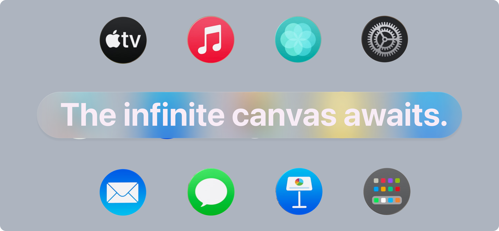
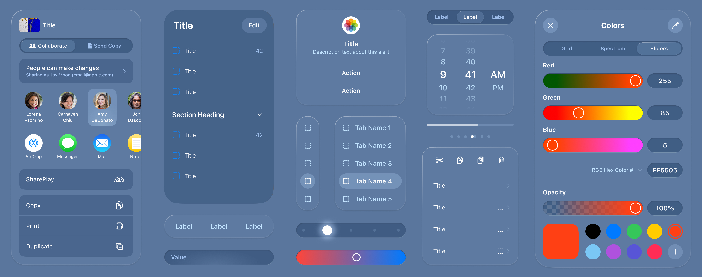
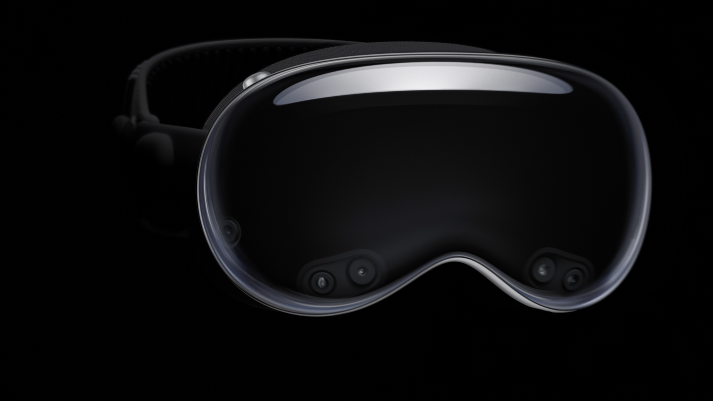
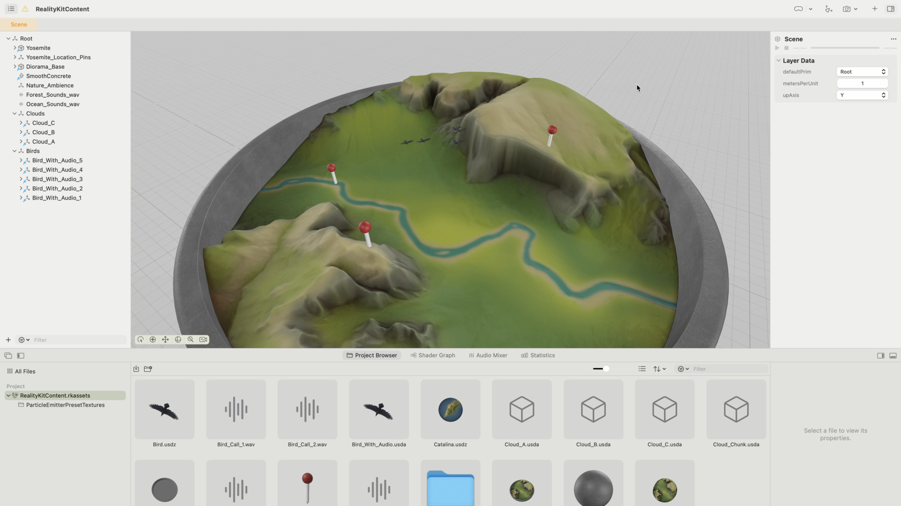

  

At WWDC2023, Apple finally launched the long-anticipated headset, it's called: **Apple Vision Pro**.

> Apple Vision Pro is a revolutionary spatial computer that seamlessly blends digital content with the physical world, while allowing users to stay present and connected to others.
> ...visionOS, the world’s first spatial operating system, Apple Vision Pro lets users interact with digital content in a way that feels like it is physically present in their space.

visionOS combined with Vision Pro, is Spatial Computing the future of personal computer?

We'd like to explore the possibility that: MR (eg. AR/VR) dominate the way we interact with digital machines and contents.

This repository stands for a **Warehouse** for collecting **resources, tutorials, notes and codes** for building visionOS apps and exploring all the possibilities of spatial computing and MR, every contributions of good-value to this repository is welcomed.

For starters, the official tutorial is always 

a good place to begin:

[Learn visionOS](https://developer.apple.com/visionos/learn/)

And [**SDK for visionOS came out on June 22, 2023**](https://developer.apple.com/download/all/?q=xcode%2015).

Apple also provided few [Sample Projects for visionOS](/Sample-Projects)

Breaking News:

## Developer Kit

**Applications are now open**. (2023-07-25)

### How to apply for  Vision Pro developer kit

Submit a brief application for a Vision Pro developer kit. You’ll need to be an Account Holder in the Apple Developer Program, provide details about your team’s development skills and existing apps, and agree to the terms and conditions. Applications will be reviewed and priority will be given to applicants creating an app that takes advantage of visionOS features and capabilities.

[Apply](https://developer.apple.com/visionos/developer-kit/apply/)

### How to apply for  developer labs

Sign in with your Apple ID and complete the request form, which will require a screenshot of your app running in the visionOS simulator. Requests will be reviewed and priority will be given to new visionOS apps and existing iPadOS and iOS apps being enhanced for visionOS. We recommend one designer and one engineer attend the lab. Each member will need to submit a request separately for the same day and location.

[Apply](https://developer.apple.com/events/view/upcoming-events)

> Vision Pro developer kit

To support great ideas for apps and games for visionOS, developer kits will be available to help bring your creations to life on Apple Vision Pro. These kits provide the ability to quickly build, iterate, and test on Apple Vision Pro, so your app or game will be ready to deliver amazing experiences. Stay tuned for how to apply.

> Apple Vision Pro compatibility evaluations

If you currently have an iPad or iPhone app on the App Store, we can help you test it on Apple Vision Pro. Request a compatibility evaluation from App Review to get a report on your app or game’s appearance and how it behaves in visionOS.

> Apple Vision Pro developer labs

Apply for the opportunity to attend an Apple Vision Pro developer lab, where you can experience your visionOS, iPadOS, and iOS apps running on Apple Vision Pro. With direct support from Apple, you’ll be able to test and optimize your apps and games, so they’ll be ready when Apple Vision Pro is available to customers. Labs will be available in six locations worldwide: **Cupertino, London, Munich, Shanghai, Singapore**, and **Tokyo**.

## Intro

[Introducing Vision Pro - the Hardware](https://www.apple.com/apple-vision-pro/)

[Introducing Vision Pro and visionOS](https://developer.apple.com/news/?id=p7g1u5kk)

## Discover

[Discover visionOS](https://developer.apple.com/visionos/)

[Prepare for visionOS](https://developer.apple.com/visionos/prepare/)

## Explore RealityKit and 3D content

- consider using [RealityKit](https://developer.apple.com/documentation/RealityKit/) to render 3D content.
- you'll also be able use [Unity](Unity.md)’s authoring tools to create great experiences for spatial computing.
- build surface and geometry shaders with MaterialX in Reality Composer Pro.
 [MaterialX](https://materialx.org/) is an open standard supported by leading film, visual effects, entertainment, and gaming companies.
- use Reality Composer Pro to build USDZ assets for visionOS projects.

[More on USD](USD.md)

**Right order for watching sessions**:

1. Meet Reality Composer Pro
2. Explore materials in Reality Composer Pro
3. Work with Reality Composer Pro content in Xcode

[Notes and Resource](Reality-Composer-Pro.md) of Reality Composer Pro.

## Design fro visionOS

[Apple Design Resources for visionOS](https://developer.apple.com/design/resources/#visionos-apps)

## WWDC2023

[Highlights of new technologies introduced at WWDC23](https://developer.apple.com/documentation/Updates/wwdc2023)
Browse a selection of documentation for new technologies, frameworks, and APIs introduced at WWDC23. Many existing frameworks have added significant functionality, and you’ll find new ways to enhance your apps targeting the latest platform release.

Let's Build !
